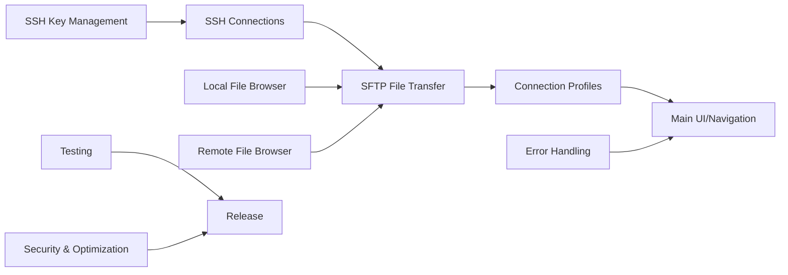
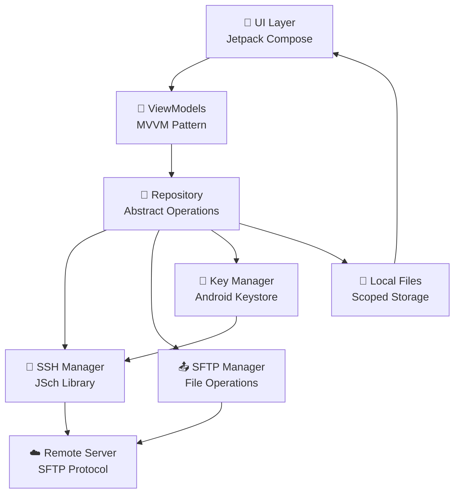
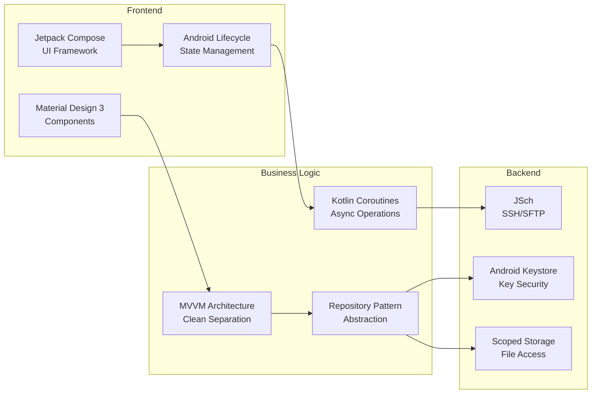
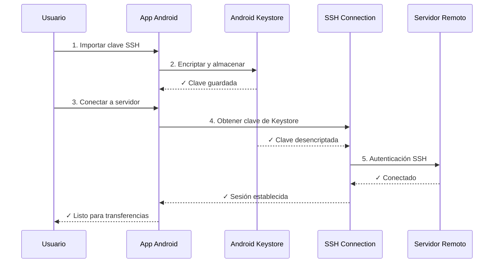
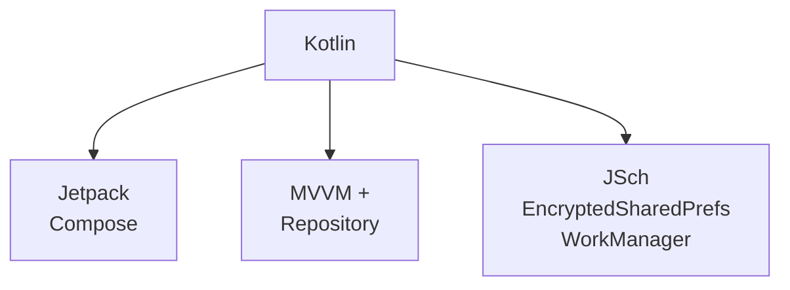

# Android SFTP SSH Client

Un cliente SFTP seguro y fácil de usar para Android que permite transferir archivos entre tu dispositivo móvil y servidores remotos mediante SSH.

## 🎯 Descripción del Proyecto

**APK-SFTP** es una aplicación Android nativa que proporciona una interfaz intuitiva para:
- Conectarse a servidores SSH remotos con autenticación por clave
- Navegar y gestionar archivos locales y remotos
- Transferir archivos (upload/download) de forma segura
- Guardar perfiles de conexión para acceso rápido
- Administrar claves SSH de forma segura usando Android Keystore

### Problema que Resuelve

Actualmente, transferir archivos entre dispositivos Android y servidores remotos es complicado:
- Las soluciones existentes requieren intermediarios en la nube
- No hay control directo sobre dónde se almacenan los archivos
- La seguridad depende de terceros
- La experiencia de usuario es pobre en móvil

**APK-SFTP** proporciona acceso directo, seguro y privado sin intermediarios.

---

## 📋 Características Principales



### Capacidades Principales

| Capacidad | Descripción | Estado |
|-----------|-------------|--------|
| **SSH Connections** | Conectarse a servidores SSH con autenticación por clave | 🔵 Planeado |
| **SFTP File Transfer** | Transferir archivos de forma segura (upload/download) | 🔵 Planeado |
| **SSH Key Management** | Importar, almacenar y gestionar claves SSH de forma segura | 🔵 Planeado |
| **Local File Browser** | Navegar archivos del dispositivo Android | 🔵 Planeado |
| **Remote File Browser** | Navegar archivos del servidor SFTP | 🔵 Planeado |
| **Connection Profiles** | Guardar y reutilizar configuraciones de conexión | 🔵 Planeado |

---

## 🏗️ Arquitectura del Sistema



### Stack Tecnológico



---

## 🔐 Flujo de Seguridad



---

## 📊 Ciclo de Implementación

El proyecto está dividido en **12 Phases** con entregables claros:

```mermaid
graph LR
    P1["⚙️ Phase 1<br/>Setup"]
    P2["🔐 Phase 2<br/>SSH Auth"]
    P3["🔑 Phase 3<br/>Key Mgmt"]
    P4["📂 Phase 4<br/>Local Files"]
    P5["☁️ Phase 5<br/>Remote Files"]
    P6["📤 Phase 6<br/>Transfers"]
    P7["💾 Phase 7<br/>Profiles"]
    P8["🎨 Phase 8<br/>UI"]
    P9["⚠️ Phase 9<br/>Errors"]
    P10["✅ Phase 10<br/>Testing"]
    P11["🔒 Phase 11<br/>Security"]
    P12["🚀 Phase 12<br/>Release"]

    P1 --> P2 --> P3 --> P4 --> P5 --> P6 --> P7 --> P8 --> P9 --> P10 --> P11 --> P12

    style P1 fill:#e1f5ff
    style P2 fill:#f3e5f5
    style P6 fill:#fff3e0
    style P12 fill:#c8e6c9
```



---

## 📂 Estructura de Documentación

```
📁 docs/
├── 📄 PROPOSAL.md           # Propuesta del proyecto
├── 📄 DESIGN.md             # Diseño técnico
├── 📄 IMPLEMENTATION_TASKS.md # Lista de tareas
├── 📁 spec/                 # Especificaciones por capacidad
│   ├── 📁 ssh-connections/
│   ├── 📁 sftp-file-transfer/
│   ├── 📁 ssh-key-management/
│   ├── 📁 local-file-browser/
│   ├── 📁 remote-file-browser/
│   └── 📁 connection-profiles/
└── 📁 milestones/           # Documentación por fase
    ├── 📄 phase-01-setup.md
    ├── 📄 phase-02-ssh-connection.md
    ├── 📄 phase-03-key-management.md
    ├── ... (fases 4-12)
    └── 📄 README.md         # Índice de milestones
```

---

## 🚀 Comenzar

### Requisitos
- Android Studio 2024+
- Android SDK 26+ (API 26+)
- Kotlin 1.9+
- Git

### Instalación

```bash
# Clonar repositorio
git clone https://github.com/monghithub/apk-sftp.git
cd apk-sftp

# Abrir en Android Studio
# File > Open > Seleccionar carpeta del proyecto
```

### Estructura de Fases

Cada fase tiene su propia documentación con:
- ✅ Lista de issues/tareas
- 📝 Explicación de por qué se hace
- 🎯 Qué problema soluciona
- 🔗 Enlaces a issues en GitHub

**👉 [Ver documentación por Fase →](./docs/milestones/README.md)**

---

## 📊 Estado del Proyecto

| Métrica | Valor |
|---------|-------|
| **Total Issues** | 295 |
| **Milestones** | 12 Fases |
| **Documentación** | 100% |
| **Repositorio** | [GitHub](https://github.com/monghithub/apk-sftp) |

---

## 🔗 Enlaces Importantes

- 📋 [Issues en GitHub](https://github.com/monghithub/apk-sftp/issues)
- 🎯 [Milestones/Phases](https://github.com/monghithub/apk-sftp/milestones)
- 📚 [Documentación por Fase](./docs/milestones/README.md)
- 📖 [Propuesta Completa](./docs/PROPOSAL.md)
- 🏗️ [Diseño Técnico](./docs/DESIGN.md)
- ✅ [Tareas de Implementación](./docs/IMPLEMENTATION_TASKS.md)

---

## 📝 Documentación Técnica

### Especificaciones de Capacidades
Cada capacidad tiene una especificación detallada:

- [SSH Connections](./docs/spec/ssh-connections/spec.md)
- [SFTP File Transfer](./docs/spec/sftp-file-transfer/spec.md)
- [SSH Key Management](./docs/spec/ssh-key-management/spec.md)
- [Local File Browser](./docs/spec/local-file-browser/spec.md)
- [Remote File Browser](./docs/spec/remote-file-browser/spec.md)
- [Connection Profiles](./docs/spec/connection-profiles/spec.md)

---

## 🛠️ Desarrollo

### Stack de Desarrollo



### Cómo Contribuir

1. Selecciona un Issue de GitHub
2. Crea una rama: `git checkout -b feature/issue-123`
3. Implementa la funcionalidad
4. Haz commit: `git commit -m "feat: descripción"`
5. Push a GitHub: `git push origin feature/issue-123`
6. Abre un Pull Request

---

## 📞 Contacto & Soporte

- 🐛 [Reportar Bugs](https://github.com/monghithub/apk-sftp/issues/new)
- 💡 [Sugerir Características](https://github.com/monghithub/apk-sftp/issues/new)
- 📧 Equipo de desarrollo

---

## 📄 Licencia

MIT License - Ver [LICENSE](./LICENSE) para detalles

---

## 🎓 Aprende Más

- [Documentación de Fases →](./docs/milestones/README.md)
- [Especificaciones de Capacidades →](./docs/spec/)
- [Diseño Arquitectónico →](./docs/DESIGN.md)

---

**Última actualización**: Marzo 2026
**Estado**: 🔵 En Planificación
**Versión**: 0.1.0-planning
