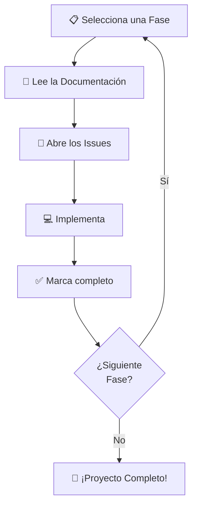

# Milestones - Guía de Implementación por Fases

Este directorio contiene la documentación detallada de cada fase del proyecto. Cada documento explica:
- ✅ Por qué se hace cada issue
- 🎯 Qué problema soluciona
- 🔗 Enlaces a los issues en GitHub
- 📋 Dependencias y prerequisitos

---

## 📊 Mapa de Fases

```mermaid
graph LR
    P1["Phase 1<br/>Setup<br/>23 tasks"]
    P2["Phase 2<br/>SSH Connection<br/>23 tasks"]
    P3["Phase 3<br/>Key Mgmt<br/>32 tasks"]
    P4["Phase 4<br/>Local Files<br/>31 tasks"]
    P5["Phase 5<br/>Remote Files<br/>33 tasks"]
    P6["Phase 6<br/>Transfers<br/>33 tasks"]
    P7["Phase 7<br/>Profiles<br/>37 tasks"]
    P8["Phase 8<br/>UI/Navigation<br/>26 tasks"]
    P9["Phase 9<br/>Error Handling<br/>18 tasks"]
    P10["Phase 10<br/>Testing<br/>18 tasks"]
    P11["Phase 11<br/>Security<br/>7 tasks"]
    P12["Phase 12<br/>Release<br/>10 tasks"]

    P1 --> P2 --> P3 --> P4 --> P5 --> P6 --> P7 --> P8 --> P9 --> P10 --> P11 --> P12

    style P1 fill:#b3e5fc
    style P2 fill:#f3e5f5
    style P3 fill:#fff9c4
    style P6 fill:#ffe0b2
    style P12 fill:#c8e6c9
```



---

## 📖 Fases Disponibles

### Fundación (Fases 1-3)
Crear la base técnica de la aplicación

| Fase | Descripción | Issues | Docs |
|------|-------------|--------|------|
| **Phase 1** | Setup & Dependencias | 23 | [→](./phase-01-setup.md) |
| **Phase 2** | SSH Connection | 23 | [→](./phase-02-ssh-connection.md) |
| **Phase 3** | SSH Key Management | 32 | [→](./phase-03-key-management.md) |

### Interfaz de Usuario (Fases 4-5)
Interfaz para navegar archivos

| Fase | Descripción | Issues | Docs |
|------|-------------|--------|------|
| **Phase 4** | Local File Browser | 31 | [→](./phase-04-local-file-browser.md) |
| **Phase 5** | Remote File Browser | 33 | [→](./phase-05-remote-file-browser.md) |

### Funcionalidad Core (Fases 6-7)
Operaciones de archivos y perfiles

| Fase | Descripción | Issues | Docs |
|------|-------------|--------|------|
| **Phase 6** | File Transfer Ops | 33 | [→](./phase-06-file-transfer.md) |
| **Phase 7** | Connection Profiles | 37 | [→](./phase-07-connection-profiles.md) |

### Integración & Polish (Fases 8-9)
UI completa y manejo de errores

| Fase | Descripción | Issues | Docs |
|------|-------------|--------|------|
| **Phase 8** | Main UI & Navigation | 26 | [→](./phase-08-main-ui.md) |
| **Phase 9** | Error Handling | 18 | [→](./phase-09-error-handling.md) |

### Calidad & Release (Fases 10-12)
Testing, seguridad y lanzamiento

| Fase | Descripción | Issues | Docs |
|------|-------------|--------|------|
| **Phase 10** | Testing | 18 | [→](./phase-10-testing.md) |
| **Phase 11** | Security & Optimization | 7 | [→](./phase-11-security.md) |
| **Phase 12** | Release Preparation | 10 | [→](./phase-12-release.md) |

---

## 🔄 Flujo de Trabajo



---

## 📚 Cómo Usar Esta Documentación

### Para Desarrolladores
1. Lee la fase de tu asignación
2. Entiende el contexto (por qué se hace)
3. Ve al documento .md para detalles específicos
4. Abre los issues en GitHub
5. Implementa las tareas

### Para Project Managers
1. Usa este índice para ver el progreso
2. Cada fase tiene su próprio documento
3. Puedes seguir el progreso por milestone

### Para Revisores de Código
1. Consulta la especificación en la fase relevante
2. Verifica que la implementación cumpla con los requisitos
3. Revisa contra los scenarios definidos en `spec/`

---

## 📊 Estadísticas

**Total de Tareas**: 291
**Total de Issues**: 295

**Distribución por Fase**:
- Foundation: 78 tareas (27%)
- UI: 64 tareas (22%)
- Core: 70 tareas (24%)
- Integration: 44 tareas (15%)
- Quality: 35 tareas (12%)

---

## 🔗 Links Útiles

- [Issues en GitHub](https://github.com/monghithub/apk-sftp/issues)
- [Milestones en GitHub](https://github.com/monghithub/apk-sftp/milestones)
- [Especificaciones](../spec/)
- [Diseño Técnico](../DESIGN.md)
- [Propuesta](../PROPOSAL.md)

---

## 📝 Estructura de Documentos

Cada documento de fase contiene:

```markdown
# Phase X: [Nombre]

## 📌 Descripción General
Por qué esta fase existe y qué problema resuelve

## 🎯 Objetivos
Qué debe completarse

## 📋 Issues (X tareas)
Para cada issue:
- ID y nombre
- ¿Por qué se hace?
- ¿Qué soluciona?
- Enlaces a GitHub

## ✅ Criterios de Aceptación
Cómo saber que está completo

## 🔗 Dependencias
Qué debe estar listo antes de empezar

## 📚 Referencias
Especificaciones y documentación relacionada
```

---

**Última actualización**: Marzo 2026
**Total de Documentos**: 12 fases + este índice
